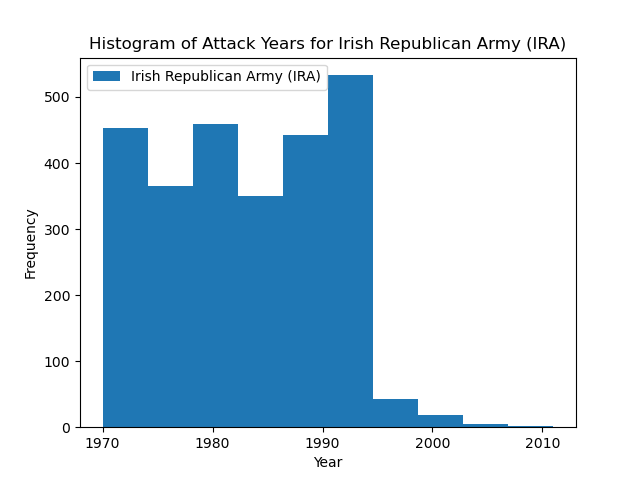

# The global war on terror, a retrospective

On September 11th, 2001 an attack would be launched on the people of the United States which would come to largely be felt around the world. The terrorist attack on the Twin Towers in New York City would spark a conflict that would span more than two decades, on September 14th, 2001 the United States of America began a campaign that it would intially call The Global War on Terror and on October 7th, 2001 the war in afganistan began under codename: Operation Enduring Freedom.

But was the United States' effort to quell global terrorism sucessful? 

## A picture of terrorist activities 

First lets observe what the land scape looked like before, during and after the Global War on Terror. The campaign was orginaly intended as an offensive against all majoor terrorist groups and terrorist sponsoring states, mostly aimed at those operating in the middle east, the largest and as we will see, most active of these groups being the Taliban. 

Intrestingly we see that the for a time during Operation Enduring Freedom there does seem be a drop in terrorist atctivties, we could speculate that this was because of the U.S. operations in the middle east, however even just a few years into that campaign incedents of terrorist attacks not only begin to increase, but begin to increase exponentialy over time. 

For some more context lets take a look at the organization involved in these attacks, and get an idea of what percentage of attacks they are responsible for:

As we can see, among organized terrorist groups the Taliban is the largest, however acts of violence committed by individuals and unnamed organizations make up the bulk of activity. 

Lets look at the rest of the groups pictured and get an idea of how each's activity has changed overtime. 

